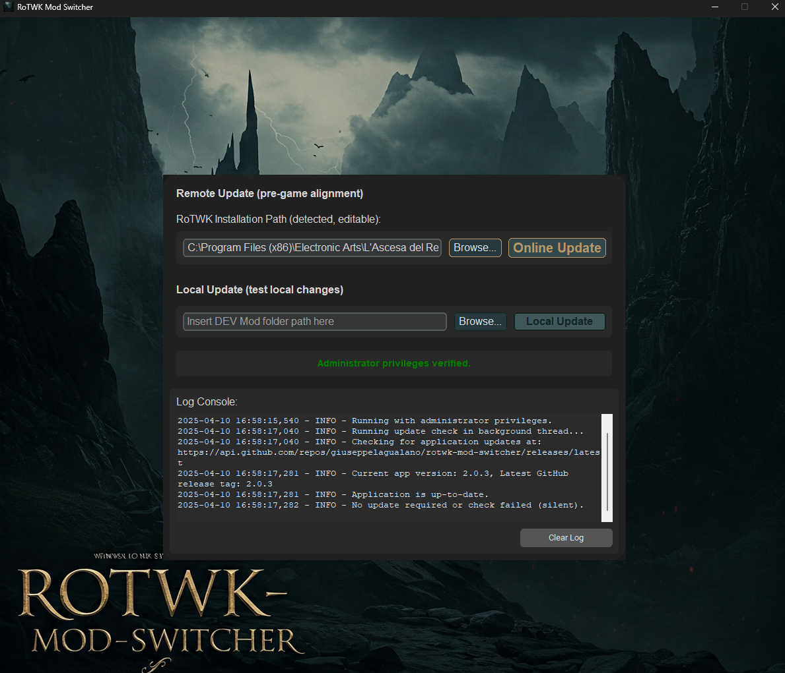

# TROWMod Updater & Local Builder

[](https://opensource.org/licenses/MIT)

**An automated tool to simplify updating and synchronizing TROWMod versions for The Lord of the Rings™: The Rise of the Witch-king™ (RotWK), primarily designed for development and testing within a close group of friends.**

This tool facilitates seamless mod version alignment for the fantastic **TROWMod** created by **Simone Orlandi**.



---

## Motivation

Playing modded games like RotWK with friends often involves ensuring everyone has the *exact* same mod version, especially during active development phases. Manually downloading, extracting, and installing updates can be tedious and error-prone, leading to frustrating version mismatches discovered only mid-game.

Inspired by Lean principles to eliminate waste (in this case, wasted time and effort), this tool was created to automate the update process. It provides a simple, one-click solution for our friend group to synchronize to the latest TROWMod release or test local builds consistently, ensuring we can jump straight into playing without version headaches.

While primarily built for personal use within our group, this repository is public for transparency and potentially for others facing similar challenges.

## Features

* **Remote Update:** Automatically fetches the latest official release of TROWMod directly from Simone Orlandi's GitHub repository (`SymoniusGit/TROWMod`).
* **One-Click Install:** Downloads, extracts the mod source, builds the necessary `.big` archives (`!TROWMOD_INI.big`, `!trowmod.big`, `Italian.big`), and places them directly into your RotWK installation directory.
* **Local Build:** Allows developers/testers to select a local TROWMod development folder and build the `.big` archives from local files, installing them for immediate testing.
* **RotWK Path Detection:** Attempts to automatically detect your RotWK installation path from the Windows Registry.
* **Manual Path Input:** Allows manually specifying the RotWK path and the local development path if needed.
* **User-Friendly GUI:** Simple interface built with CustomTkinter.
* **Clear Logging:** Provides feedback on the update/build process in a dedicated log console.
* **Admin Check:** Verifies if the tool is run with administrator privileges, which are often required for writing to the game's installation directory.

## Target Mod

This tool is specifically designed for:

* **Mod:** TROWMod
* **Creator:** Simone Orlandi
* **Repository:** [https://github.com/SymoniusGit/TROWMod](https://github.com/SymoniusGit/TROWMod)

Please support the original mod creator! This tool merely streamlines the installation process for specific use cases.

## Requirements

* Windows Operating System (due to Registry access and game path conventions)
* A valid installation of **The Lord of the Rings™: The Rise of the Witch-king™**.
* Python 3.x (if running from source)
* Administrator privileges (recommended, may be required to write to the game directory).

## Installation & Usage

### Using a Pre-built Release (Recommended for End-Users)

1.  Go to the [Releases Page](https://github.com/giuseppelagualano/rotwk-trowmod-switcher/releases) of this repository. 2.  Download the latest `.exe` file.
3.  Run the downloaded executable **as Administrator**.
4.  The tool will attempt to find your RotWK path. Verify it's correct or use "Browse..." to select the main game installation folder (e.g., `C:\Program Files (x86)\Electronic Arts\The Lord of the Rings, The Rise of the Witch-king\`).
5.  **To get the latest official mod version:** Click the "**Remote Update**" button.
6.  **To test a local development version:**
    * Use the second "Browse..." button to select the root folder of your local TROWMod source code (the one containing `data`, `arts`, `lang` subfolders).
    * Click the "**Local Update**" button.
7.  Monitor the log console for progress and any potential errors.

## Dependencies (for source)

* [customtkinter](https://github.com/TomSchimansky/CustomTkinter): For the graphical user interface.
* [Pillow](https://python-pillow.org/): For handling images (like the background).
* [pyBIG](https://github.com/ClemensCore/pyBIG): For creating the required `.big` archive files for the game.

*(These should be included in `requirements.txt`)*

## License

This project is licensed under the MIT License - see the [LICENSE](LICENSE) file for details. ## Acknowledgements

* Huge thanks to **Simone Orlandi** for creating the excellent **TROWMod**. This tool wouldn't exist without his work.
* Thanks to the creators of the libraries used (`customtkinter`, `pyBIG`, `Pillow`).

## How to create the exe:
```
python -m PyInstaller .\main.spec
```
